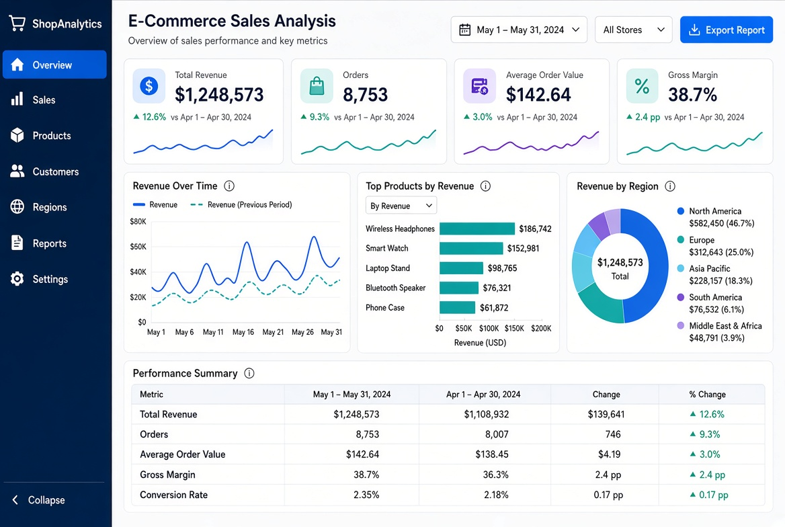

# E-commerce Sales Analysis

Professional sales data analysis project for an e-commerce business using **SQL**, **Excel**, and interactive dashboards.

## Project Overview

This project analyzes e-commerce sales data to extract actionable insights about:
- Total Revenue & Growth
- Top Performing Products
- Regional Performance
- Sales Trends over time
- Key Performance Indicators (KPIs)

## Tools Used

- **SQL** → Data extraction & analysis
- **Microsoft Excel** → Dashboard & reporting
- **Power BI / Excel Charts** → Data visualization

## Key Insights

- Identified top revenue-generating products
- Analyzed sales performance by region
- Tracked monthly revenue trends
- Calculated important KPIs (Average Order Value, Gross Margin, etc.)

## Project Structure
ecommerce-sales-analysis/
├── data/                  # Sample datasets
├── sql/                   # SQL analysis queries
├── excel/                 # Excel dashboard files
├── images/                # Dashboard screenshots
└── README.md

## Dashboard Preview

## How to Use

1. Explore the SQL queries in the `sql` folder
2. Open the Excel dashboard in the `excel` folder
3. Review the insights and visualizations

## Author

**Mostafa Halafawi**  
Senior Data & Performance Analyst  
📍 Cairo, Egypt
